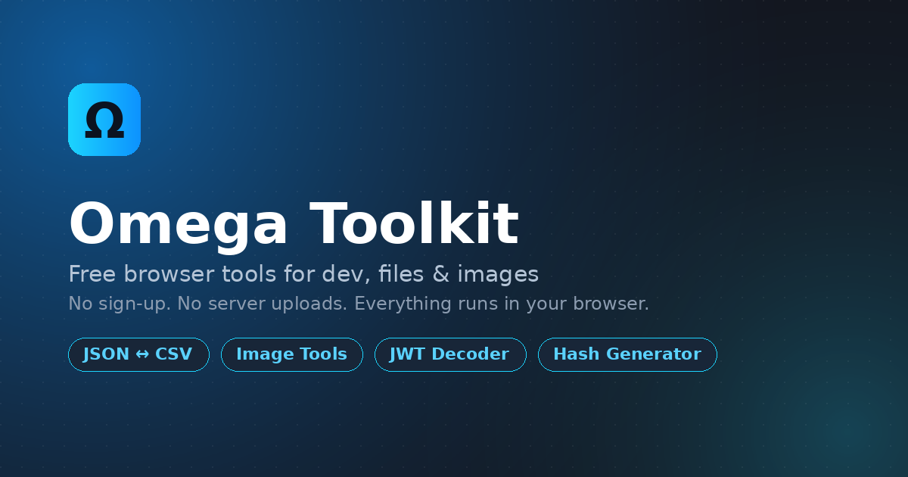

# Omega Toolkit

A free, open-source collection of everyday browser tools for developers, students, and everyday users — file converters, image utilities, and dev tools that run entirely client-side. No sign-up, no server uploads, nothing tracked.

**Live site:** [https://omega-toolkit.vercel.app/](https://omega-toolkit.vercel.app/) <!-- TODO: update -->

 <!-- TODO: add screenshot -->

## Why

Most converter/utility sites ask you to sign up or upload files to a server just to resize an image or format some JSON. Omega Toolkit does everything in the browser — nothing you process here ever leaves your machine.

## Features

- 🗂️ **File tools** — JSON ⇄ CSV, JSON ⇄ Excel, Myanmar font converter
- 🖼️ **Image tools** — JPG ⇄ PNG, resize, crop, favicon generator, Base64 ⇄ image, QR scanner
- 🛠️ **Dev tools** — JSON formatter, hash generator, Base64 encode/decode, UUID generator, JWT decoder, regex tester, URL encode/decode
- 🎵 **Media tools** — MP3 converter
- 🎨 **Color tools** — color picker
- 🌗 Light/dark theme
- 📱 Fully responsive
- 🔒 100% client-side — no data ever touches a server

## Tech Stack

- [React](https://react.dev) + [TypeScript](https://www.typescriptlang.org/)
- [Vite](https://vitejs.dev) — build tool
- [MUI (Material UI)](https://mui.com) — component library
- [React Router](https://reactrouter.com) — routing
- [GSAP](https://gsap.com) — animations

## Getting Started

### Prerequisites

- Node.js 18+
- npm (or yarn/pnpm)

### Installation

```bash
git clone https://github.com/Omega-Dimension/omega-toolkit.git
cd omega-toolkit
npm install
```

### Development

```bash
npm run dev
```

Runs the app at `http://localhost:5173` (default Vite port).

### Build

```bash
npm run build
```

Outputs a production build to `dist/`.

### Preview production build

```bash
npm run preview
```

## Project Structure

```
src/
├── assets/          # Images, static files
├── components/       # Shared/reusable components (Hero, Footer, NavItem, etc.)
├── data/             # Static data (menuItems, etc.)
├── hooks/            # Custom hooks (useThemeMode, useModal)
├── layout/           # Layout components (MainLayout, Header, Footer)
├── pages/            # Route pages
│   ├── public/        # Home, About
│   ├── colors/         # Color tools
│   ├── dev/             # Dev tools (JSON formatter, JWT decoder, etc.)
│   ├── files/            # File converters
│   ├── images/            # Image tools
│   └── media/              # Media tools
├── routes/           # Route definitions (routes.ts, toolRoutes.ts)
├── utils/            # Utility functions & shared style helpers
└── App.tsx           # Root component
```

## Adding a New Tool

1. Create the page component under the relevant `src/pages/<category>/` folder.
2. Add the route to `src/routes/toolRoutes.ts`.
3. Add the entry to `src/data/menuItems.ts` so it shows up in the header/mobile menu.
4. If it's a good candidate for the homepage spotlight, add its path to `featuredPaths` in `src/utils/featuredTools.ts`.

## Deployment

This is a static frontend with no backend, database, or environment variables — deploys cleanly to [Vercel](https://vercel.com), Netlify, or any static host.

**Vercel:**
```bash
npm i -g vercel
vercel
```

A `vercel.json` rewrite is included so client-side routes (e.g. `/dev/jwt-decoder`) work on direct visits/refreshes:
```json
{
  "rewrites": [{ "source": "/(.*)", "destination": "/index.html" }]
}
```

## Contributing

Found a bug or have an idea for a new tool? Open an issue or a PR — feedback from people who actually use the tools directly shapes what gets built next.

[Report an issue](https://github.com/Omega-Dimension/omega-toolkit/issues)

## License

<!-- TODO: pick a license, e.g. MIT -->
MIT

## Author

Built and maintained solo by **Fento**.

- GitHub: [@Omega-Dimension](https://github.com/Omega-Dimension)
